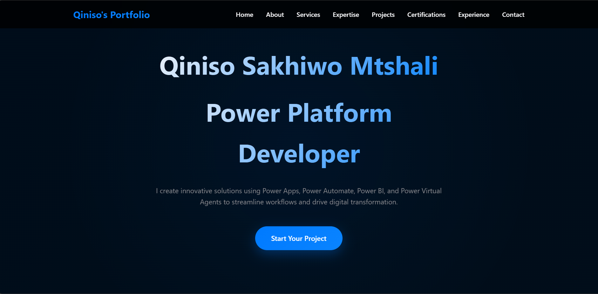

# Qiniso Sakhiwo Mtshali – Developer Portfolio

Welcome to my personal developer portfolio! This site showcases my work as a Power Platform Developer, Multimedia Engineer, and creative technologist.

## 🌐 Live Demo

**🔗 [View Portfolio](https://qinisomtshali.github.io/qiniso-portfolio/)**  
---

## 🚀 About

This portfolio highlights:

- Power Platform apps I've built (e.g. Leave Request System, QA Flow)
- Certifications I’ve earned (PL-400, PL-200, AZ-900, MB-210, etc.)
- My career journey and internship experience
- Clean design inspired by Apple with interactive and animated UI elements

---

## 🛠️ Tech Stack

- **HTML5** / **CSS3** / **JavaScript**
- **GitHub Pages** (for hosting)
- **Glassy UI + CSS animations**
- Chart.js for data visualization (coming soon)
- Lottie or custom hover effects (planned)

---

## 📸 Screenshots

| Hero Section | Project Cards |
|--------------|---------------|
|  |  |
---

## 📄 License

This project is licensed under the [MIT License](LICENSE) — feel free to fork, clone, and build your own version!

---

## 🙋‍♂️ Contact Me

- 📧 Email: qiniso.sakhiwo.mtshali@gmail.com
- 🌍 Location: Johannesburg, South Africa
- 💼 [LinkedIn](https://www.linkedin.com/in/qiniso-mtshali-532394173/)

---

> Built with passion by Qiniso — always growing, always shipping 🚀
